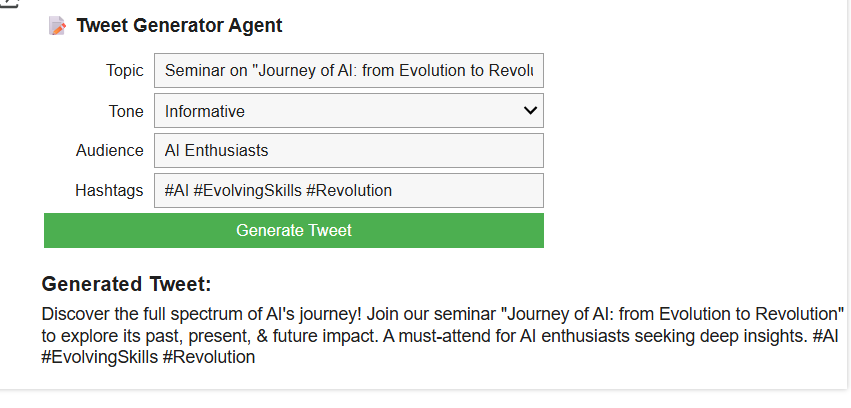
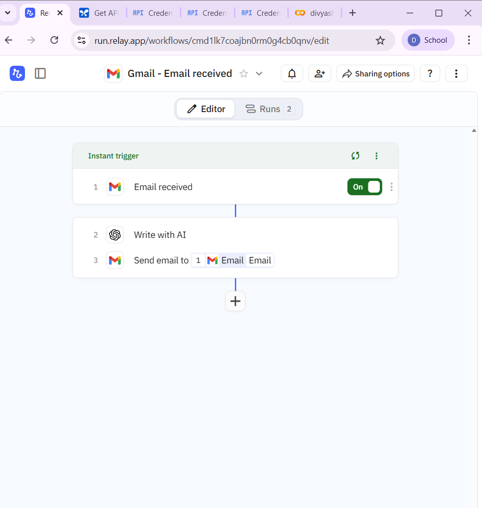
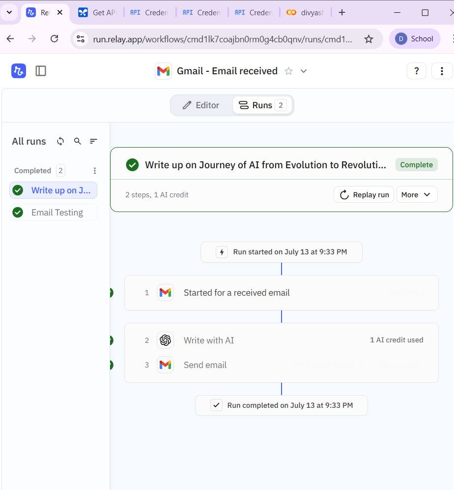
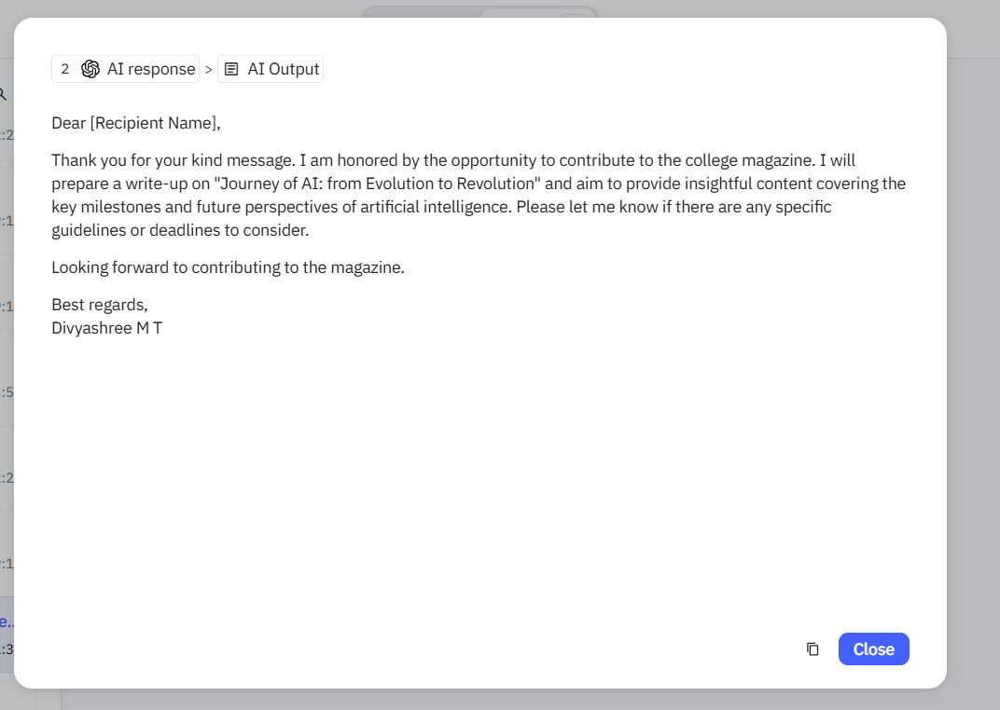

# AI Agents: Reflex & Complex
This project demonstrates two types of AI agents - one built using Python and Google Colab, and another using a no-code workflow in the Relay App platform.

## 1. Reflex Agent – Tweet Generator

A simple reflex-based AI agent implemented using Google Colab. It takes user input like topic, tone, audience, and hashtags, and generates a tweet using the Gemini (LLM) API.

### Features:
- Input-driven tweet generation
- Interactive UI using `ipywidgets`
- Uses Google Gemini (2.5 Flash) via `google-generativeai`

### File: [Reflex Agent Notebook](divyashreemt_My_Simple_agent.ipynb)
 Tweet Generator Demo
  

 
## 2. Complex Agent – Email Auto-Responder

A complex, event-driven AI agent built using the **Relay App**. It listens for incoming emails, analyzes the content using an LLM, generates a suitable response, and sends it automatically, with no user intervention.

### Features:
- Triggered on email arrival
- AI-based content understanding
- Auto-generates and sends replies
- Completely no-code using Relay blocks

## Screenshots (Relay Agent Setup)

Here are some screenshots from the Relay App configuration and agent activity:

### Setup Interface:

### Trigger Flow:

### Sample Email Reply:

